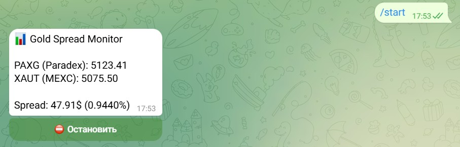

# 📊 Gold Spread Bot

A Telegram bot for real-time monitoring of the price spread between **PAXG** (Paradex) and **XAUT** (MEXC) — two gold-backed crypto tokens traded on different exchanges.

---

## 💡 What It Does

The bot tracks live prices of gold-pegged tokens across two exchanges and calculates the spread between them — useful for arbitrage monitoring and market analysis.

- **PAXG-USD-PERP** — fetched from [Paradex](https://paradex.trade) via WebSocket (real-time order book)
- **XAUT_USDT** — fetched from [MEXC](https://www.mexc.com) via REST API

The bot displays:
- Live mid-price from each exchange
- Absolute spread in USD
- Relative spread in %

Updates every **10 seconds** directly in the Telegram message.

---

## 🚀 How to Use

This bot is a template — you can deploy your own instance in a few steps:

1. **Get a Telegram bot token** — open [@BotFather](https://t.me/BotFather) in Telegram, send `/newbot` and follow the instructions. Save the token you receive.
2. **Fork this repository** — click the **Fork** button at the top right of this page
3. **Add your token** — go to **Settings → Secrets and variables → Actions → New repository secret**, name it `BOT_TOKEN` and paste your token
4. **Run the bot** — go to **Actions → Run Telegram Bot → Run workflow**
5. **Open Telegram** — find your bot and send `/start`

> The bot will start streaming live gold spread data every 10 seconds directly in your chat.

---

## ⚙️ How to Run

### Option 1 — GitHub Actions (quick demo, free)

Best for testing or showing a demo to a client. No server needed.

- Go to **Actions → Run Telegram Bot → Run workflow**
- The bot runs for up to **6 hours** per session
- GitHub free tier includes **2,000 minutes/month**
- You can also schedule auto-runs using cron in `run_bot.yml`

---

### Option 2 — VPS Server (recommended for 24/7)

For continuous operation, deploy on a Linux VPS (e.g. Hetzner, DigitalOcean, around $4-6/month).

**Step 1 — Connect to your server:**

    ssh root@your_server_ip

**Step 2 — Clone the repository:**

    git clone https://github.com/natalialeaiart/gold-spread-bot.git
    cd gold-spread-bot

**Step 3 — Install dependencies:**

    pip install -r requirements.txt

**Step 4 — Create .env file with your token:**

    echo "BOT_TOKEN=your_token_here" > .env

**Step 5 — Run with auto-restart:**

    screen -S bot
    python bot.py

The bot will run 24/7 and restart automatically if the server reboots.

---

## Tech Stack

| Tool | Purpose |
|------|---------|
| Python 3.11 | Core language |
| python-telegram-bot | Telegram Bot API |
| websockets | Real-time Paradex data |
| aiohttp | MEXC REST API calls |
| asyncio | Async concurrent execution |
| python-dotenv | Secure token management |
| GitHub Actions | CI/CD and scheduled runs |

---

## Project Structure

    gold-spread-bot/
    ├── bot.py                    # Main bot code
    ├── requirements.txt          # Python dependencies
    ├── .env                      # Your secret token (not committed)
    ├── .gitignore                # Excludes .env and venv
    └── .github/
        └── workflows/
            └── run_bot.yml       # GitHub Actions workflow

---

## Security Notes

- Never commit your `.env` file — it contains your bot token
- Use GitHub Secrets for CI/CD deployments
- Keep your repository private if sharing with clients

---

## Author

**Natalia** — freelance developer specializing in trading bots, automation, and crypto tools.

GitHub: [@natalialeaiart](https://github.com/natalialeaiart)

---

## License

MIT — free to use and modify with attribution.
